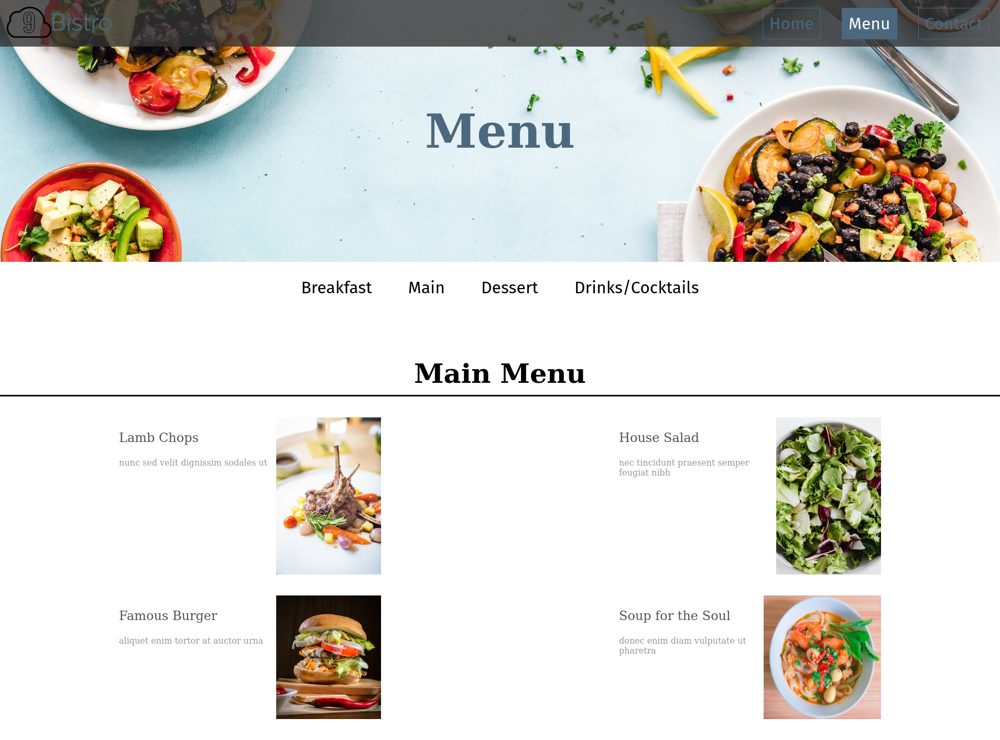

# restaurant-page

Home Page             |  Menu Page
:-------------------------:|:-------------------------:
  |  

[Live Page](https://sebastienpj.github.io/restaurant-page/)

A fictitious restaurant page created using mostly javascript.  

Topics learned/reinforced:
- Node Package Manager
- Webpack
- ES6 Modules
    - Importing and Exporting modules
- DOM Manipulation:
  - Selecting elements using Javascript
  - Adding and removing content from page 
  - Adding Event Listeners to DOM elements
